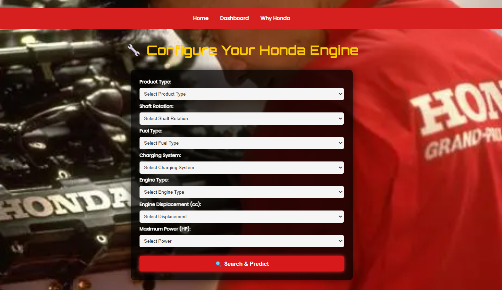
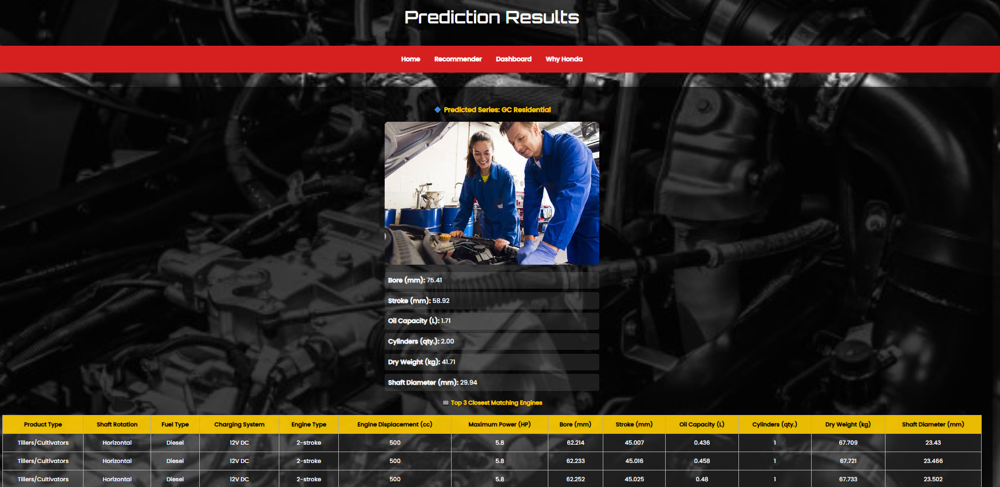
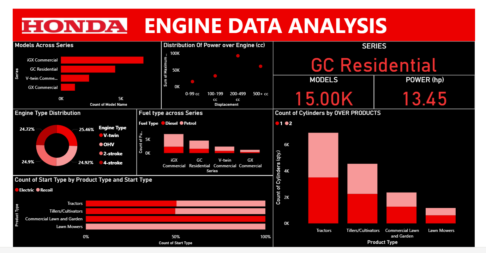
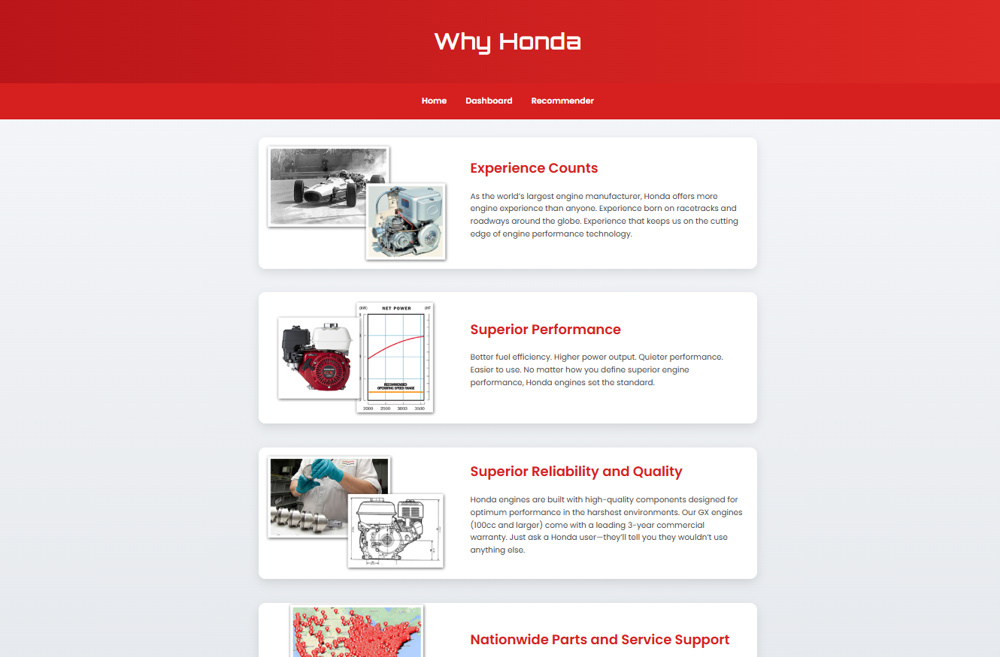
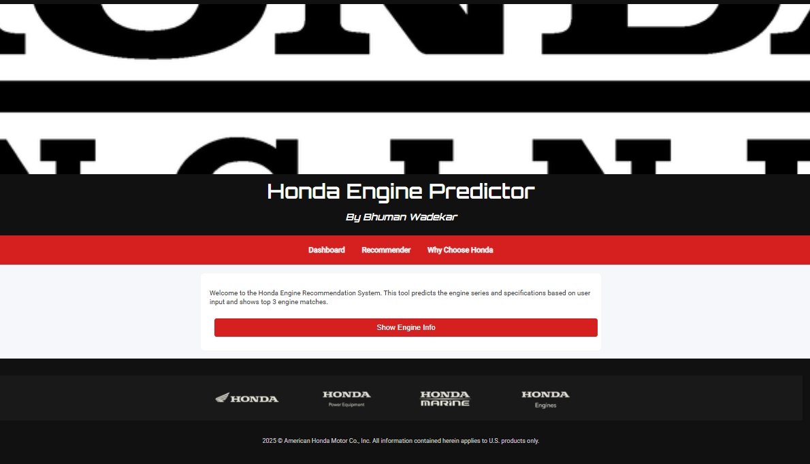

````markdown
# 🧠 Honda Engine Recommendation System

  

An intelligent, ML-powered **Flask web application** that recommends the most suitable **Honda engine series and specifications** based on user-defined inputs such as fuel type, power requirement, engine type, and more.

---

## 🔍 Preview

### 🎛️ Input Form
> Users select engine requirements using a structured dropdown interface.



---

### 📊 Output Prediction + Top 3 Matches
> Results page displays predicted **series**, detailed **specs**, and the **top 3 closest engine options**.



---

### 📈 Dashboard (Power BI Analysis)
> Embedded Power BI visuals give a breakdown of engine data across series, product types, and key features.



---

### ❓ Why Honda
> Informational section showcasing Honda's strengths, quality, and innovation.



---

### 🔚 Homepage
> Landing page welcoming users and guiding them through the recommendation process.



---

## 💡 Key Features

- 🔍 Predicts **engine series** using a trained classification model.
- 📐 Predicts **specifications** (e.g. Bore, Stroke, Power, Oil Capacity) via regression.
- 🏆 Shows **top 3 engine recommendations** based on closest feature match.
- 📊 Integrated Power BI dashboard for engine insights.
- 🌐 Multi-page Flask interface with navigation between Home, Dashboard, and Recommender.

---

## 🧠 Tech Stack

| Component     | Technology                     |
|---------------|--------------------------------|
| Backend       | Flask                          |
| ML Models     | Random Forest (Classifier + Regressor) |
| Deployment    | Localhost / Web-hosted Flask App |
| Frontend      | HTML, CSS (Jinja Templates)    |
| Visualisation | Power BI                       |
| Data Handling | Pandas, scikit-learn, joblib   |

---

## ⚙️ Installation Guide

### Step 1: Clone the Repository
```bash
git clone https://github.com/your-username/honda-engine-recommender.git
cd honda-engine-recommender
````

### Step 2: Create Virtual Environment

```bash
python -m venv venv
source venv/bin/activate       # Linux/macOS
venv\Scripts\activate          # Windows
```

### Step 3: Install Dependencies

```bash
pip install -r requirements.txt
```

### Step 4: Run the Flask App

```bash
python app.py
```

Visit `http://127.0.0.1:5000` in your browser.

---

## 📦 Requirements (`requirements.txt`)

```
flask
scikit-learn
pandas
numpy
joblib
flask-cors
```

---

## 📁 Project Structure

```
├── app.py
├── templates/
│   ├── index.html
│   ├── dashboard.html
│   ├── recommender.html
│   └── result.html
├── static/
│   └── style.css
├── models/
│   ├── best_regressor_model.joblib
│   ├── series_classifier_model.joblib
│   └── series_label_encoder.joblib
├── requirements.txt
└── README.md
```

---

## 📈 Example Use Case

* **User Input:** Diesel, Horizontal Shaft, 2-stroke, 5.8 HP
* **Predicted Series:** GC Residential
* **Top Matches:** Engines with closest displacement, bore, and stroke metrics
* **Dashboard Insight:** GC Residential has highest 2-stroke engine distribution

---

## 🔮 Future Improvements

* Add authentication (Admin/User views)
* Store prediction history in a database
* Export recommendation reports as PDF
* Host on Render/Heroku
